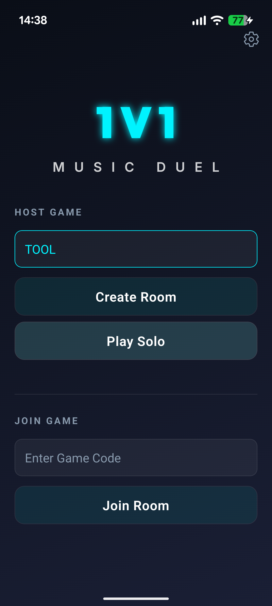
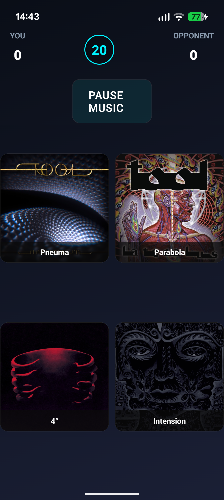
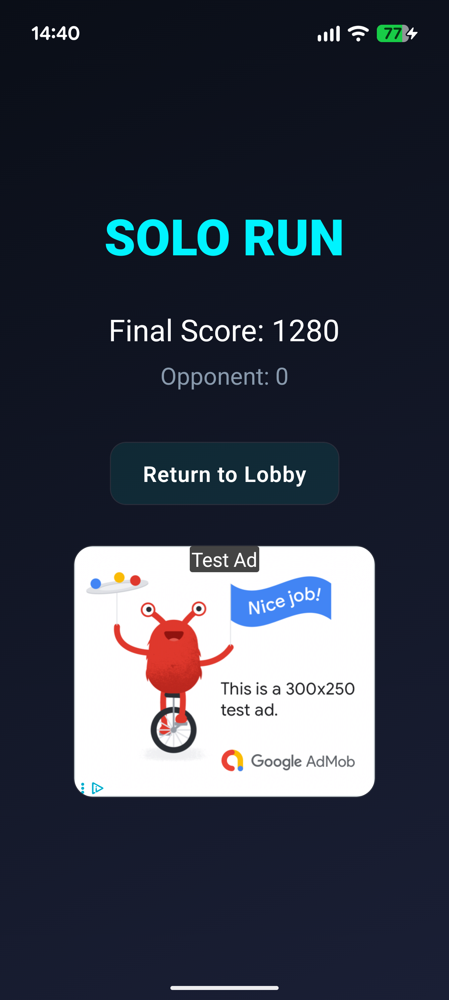

# 🎵 MusiGuess

**Real-time music trivia for iOS & Android.**

Challenge friends to guess songs from your favorite artists. Features synchronized audio playback using the iTunes API and Firebase Realtime Database.

  
  
  

## Features

- **Multiplayer**: Host/Join rooms with a simple 6-digit code.
- **Search**: Instant access to millions of songs via iTunes.
- **Audio Sync**: Sub-second latency playback sync.
- **Design**: "Midnight Luxury" aesthetic with React Native Reanimated.

## Tech Stack

Built with **React Native (Expo)**.
- **Backend**: Firebase Realtime DB + Anonymous Auth
- **State**: standard React hooks
- **Routing**: Expo Router
- **Fonts**: Outfit & Inter

## Quick Start
1. `npm install`
2. `npx expo start`

## Deployment
Hosted on GitHub Pages: [viching16.github.io/MusiGuess](https://viching16.github.io/MusiGuess)

Android APK available in [Releases](https://github.com/VICHiNG16/MusiGuess/releases).

